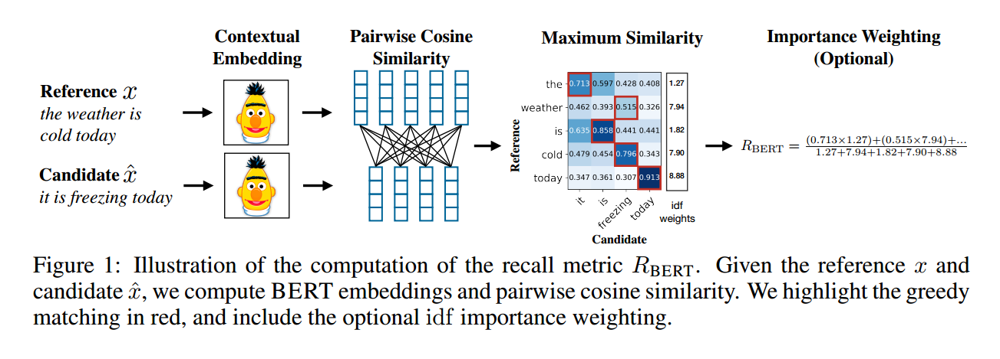

### Contribution
BERTSCORE, a novel metric for evaluating text generation using contextual embeddings. It computes a similarity score for each token in the candidate sentence with each token in the reference sentence. The similarity of two sentences is the sum of cosine similarities between their token's embeddings.

### Key points
- Embeddings of words(sub-words from BERT tokenizer) are weighted using idf from references (importance weighting) . This way, the idf for a sub-word in any candidate from any system is the same since it comes from the same test set (references)
- Pre-normalized vectors are used to compute similarity, score is in the range of 0 to 1 (using scaling)
- For scaling, a lower bound _b_ for the BERTSCORE is computed by using CommonCrawl and pairing up random sentences to compute the score
- The complete score matches each token in the candidate _x^_ to each token in the reference _x_ to compute precision, and each token in reference _x_ to each token in candidate _x^_ to compute recall. Greedy matching is used to maximize the matching similarity score, where each token is matched to the most similar token in the other sentence
- It is recommended to report F1 as the final BERTSCORE
- Multiple models are tested for contextual embeddings with ROBERTA large (24 layers) as the best model for English
- The final system level score is the average BERTSCORE of all candidate-reference pairs
- Importance weighting using idf is not that helpful, further investigation needed

### Code
- https://github.com/Tiiiger/bert_score

