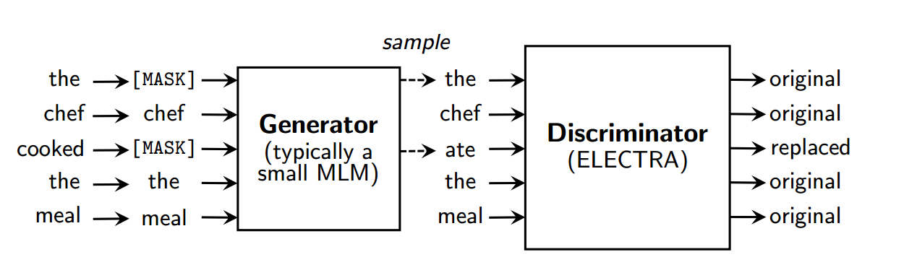

### Contribution
A sample-efficient pre-training task called replace token detection to improve upon pretrained language models such as BERT. Instead of the original masked language modeling task (MLM) where the model predicts a _masked_ token, the task here is to detect if a _replaced_ token is original (from the data) or corrupted (generated by another model). A discriminative model is trained to detect the identity of tokens replaced by a generator sample. This task is more efficient in contrast to the MLM as the task is defined over _all input tokens_ rather than just the small subset that is usually masked out (15% in BERT). This leads to better contextual embeddings which improve performance on several downstream tasks.

### Key points
- ELECTRA : Efficiently Learning an Encoder that Classifies Token Replacements Accurately
- The generator is trained using maximum likelihood rather than adversarially (as is done in GAN)
- Extensions such as weight sharing, smaller generator, and training generator together with discriminator are proposed
- A two-stage training procedure is employed: 
  - Train only the generator using maximum likelihood loss for _n_ steps
  - Initialize the weight of the discriminator with the weights of the generator. Then train the discriminator for _n_ steps, keeping the generator's weights frozen

