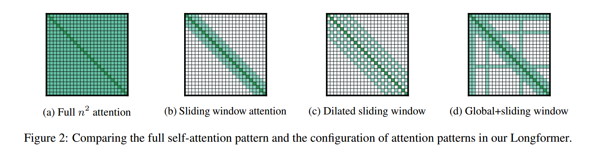

### Contribution
A sliding window based attention mechanism to help transformer models deal with very long documents. This attention computation scales linearly with sequence length O(n) in contrast to the existing attention that scales quadratically O(n2). This is done by combining a local window-based attention with a global task based attention to improve the representation capabilities of the model.

### Key points
- Longformer's attention mechanism is a combination of a windowed local-context self-attention and an end task motivated global attention which encodes inductive bias about the task.
- Local attention is used to build contextual representations, while global attention allows for full sequence representations
- Current GPUs allow for processing sequences that are upto 16K characters long, while the longformer attention allows upto 32K characters
- Custom CUDA kernels are provided that implement longformer attention efficiently 

### Code
- https://github.com/allenai/longformer

