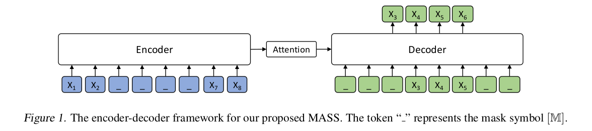
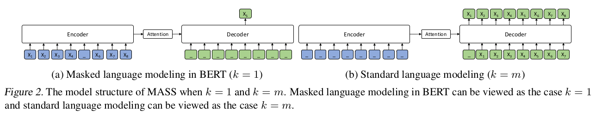

### Contribution
Inspired by BERT, a novel pre-training task (MASS) to reconstruct a missing fragment of a text using encoder-decoder framework is proposed. The encoder takes a sentence with randomly masked fragment(several consecutive tokens) as input, and the decoder tries to predict this. MASS pre-trains the encoder and decoder jointly in two steps: 
1. By predicting the masked fragment on the encoder side, the encoder is forced to understand the meaning of the unmasked tokens, in order to predict the masked tokens on the decoder side
2. By masking the input tokens of the decoder that are unmasked on the encoder side, the decoder is forced to rely more on the encoder's representation of the source sentence other than the previous tokens in the target side for next token prediction.

### Key points
- Transformer is used as the base encoder-decoder architecture
- A span of text (consecutive tokens) are masked where each masked token is replaced by a special symbol M
- The decoder when trying to predict this masked span, takes as input this special symbol M for all the unmasked tokens in the source sentence
- While masking, 80% of the time the masked token is the symbol M, 10% of the time a random token and 10% of the time remains unchanged
- The fragment length that is masked is set to 50% of the sentence length
- To reduce the computation cost, the masked tokens(padding) in the decoder is removed but the positional embeddings of the unmasked tokens stay the same (for example if the first two tokens are masked on the decoder side and are thus removed, the position embedding for the third unmasked token is still 2 and not 0)
- Fine-tuning on text summarization
  - Article as the encoder input, title as the decoder input

### Code
- https://github.com/microsoft/MASS

