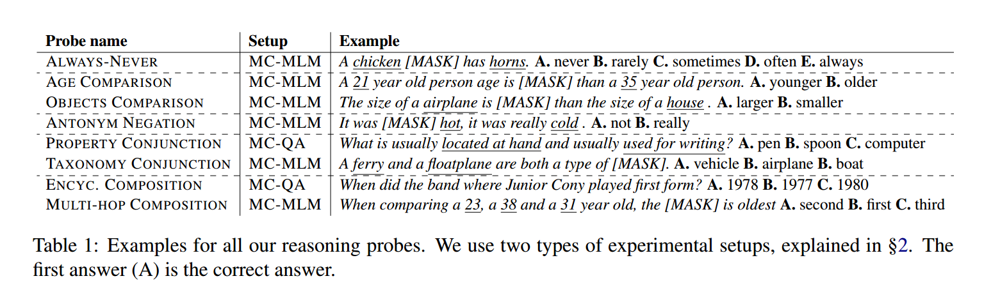
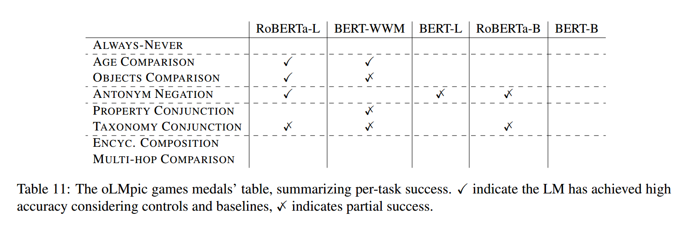

### Contribution
Eight reasoning tasks requiring symbolic operations such as comparison, concept composition and conjunction are proposed to truly understand what pretrained BERT style language models are capable of. Findings show that different models with the same underlying architecture are qualitatively different. RoBERTa is more successful at reasoning tasks while BERT completely fails. Also that LMs are highly context-dependant and do not reason in an abstract manner (as thought by many). This is evaluated across two different setups: (1) Zero shot where tasks are cast as MLM predictions without any fine-tuning of the pretrained models. Here, for a missing token, the probability distributions are limited to a predefined set of answers (K tokens, where one is the correct answer and K-1 are distractor tokens, i.e., wrong answers). (2) After fine-tuning using an increasing number of hand crafted examples. This helps identify if the strength of these models is due to pre-training or fine-tuning. 

### Key points
- Reasoning tasks can be cast as Multi-Choice MLM and Multi-Choice QA predictions
- LMs can perform comparisons to some extent but only when the numbers (ages) are in a very typical range of human ages
- RoBERTa is more sensitive to language than BERT which means it learns mostly from the fine-tuned examples
- RoBERTa is good at comparing object sizes 
- LMs do not take into account the presence of negations in a sentence, nor do they have a strong sense of antonyms encoded into them semantically
- In conjunction task, LMs prefer hypernyms that are closer in terms of edge distance on the taxonomy tree. E.g. A crow is first a bird, and then an animal
- LMs struggle with resolving concept compositional questions (E.g. Where is the headquarters of the company _ENT_ located ?)
 
### Code
- https://github.com/alontalmor/oLMpics

